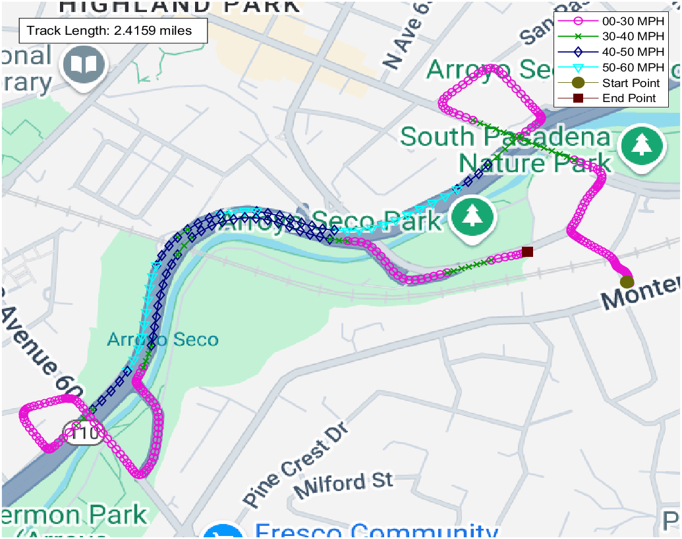
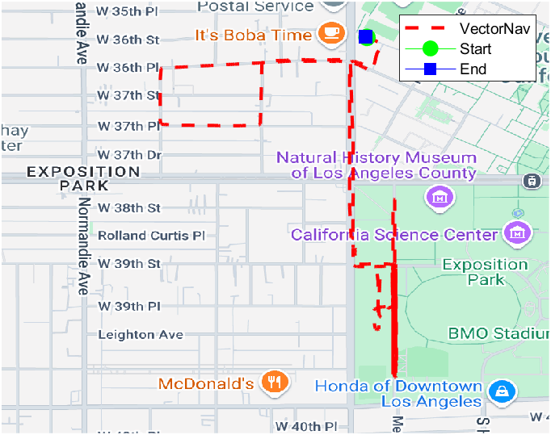

# Introduction
[](https://www.mathworks.com/matlabcentral/fileexchange/179834-gps-data-path-tracking-visualization-and-distance) [](https://matlab.mathworks.com/open/github/v1?repo=preethamam/GPS-Data-Path-Tracking-Visualization)

It might be useful to plot the GPS data for path tracking. This repository is a simple MATLAB script for the GPS path tracking and visualization using the Google Maps. In addition, it provides the total path distance in kilometers and miles.

# Quick Pipeline Visualization
| Sample plots |
| ------------- |
| Path tracking with speed|
|  |
| Simple path tracking |
|  |

# Requirements
MATLAB <br />
Mapping Toolbox <br />
Parallel Computing Toolbox <br />
Google Maps API Key

# Citation
GPS path and speed tracker MATLAB program was developed for the US Federal Highway Administration project this work is available to the public. If you use this code in your research, please use the following BibTeX entry to cite:
```bibtex
@article{chen2016inexpensive,
  title={Inexpensive multimodal sensor fusion system for autonomous data acquisition of road surface conditions},
  author={Chen, Yulu Luke and Jahanshahi, Mohammad R and Manjunatha, Preetham and Gan, WeiPhang and Abdelbarr, Mohamed and Masri, Sami F and Becerik-Gerber, Burcin and Caffrey, John P},
  journal={IEEE Sensors Journal},
  volume={16},
  number={21},
  pages={7731--7743},
  year={2016},
  publisher={IEEE}
}
```

# Acknowledgements
I thank Zohar Bar-Yehuda for making the [plot_google​_map](https://www.mathworks.com/matlabcentral/fileexchange/27627-zoharby-plot_google_map) MATLAB code available for public.

# Feedback
Please rate and provide feedback for the further improvements.
